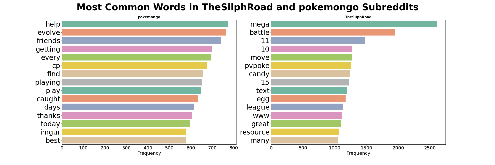
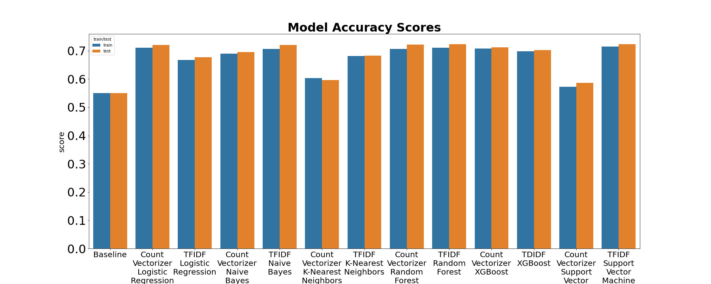

Subreddit Analysis

## Contents

- [Introduction](#Introduction)
- [Problem Statement](#Problem-Statement)
- [Summary of Analysis](#Summary-of-Analysis)
- [Modeling](#Modeling)
- [Conclusions](#Conclusions)

### Introduction

We will be using the [Pushshift API](https://github.com/pushshift/api) to get posts from 2 different subreddits and creating a model using NLP to determine which subreddit a post came from exactly. For those unfamiliar with Reddit, it is a site with many different communities called subreddits where people post about just about anything they are passionate about. For a more hands-on approach to how the site works you can visit it by clicking [here](https://reddit.com/). 

### Problem Statement

The 2 subreddits we will be looking at are [/r/TheSilphRoad](https://www.reddit.com/r/TheSilphRoad/) and [/r/pokemongo](https://www.reddit.com/r/pokemongo/). What we want to determine is if The Silph Road is actually more tailored to experienced players of Pokemon Go compared to the pokemongo subreddit. We hope that by using NLP and testing different classification models we can differentiate posts between the two subreddits by finding language that is more akin to veteran players of the game. If we can accurately tell the difference between posts on the two subreddits, the hardcore players of The Silph Road will be able brag that their subreddit is the superior one. 

### Summary of Analysis

We started out by pulling 20000 posts from each subreddit using the Pushshift API, the following code we used to do this is below:

```python
def get_20000(subreddit, last_time):
    posts = []
    for i in tqdm(range(200)): # use tqdm to see how long each iteration takes
        try:
            reddit_params = {
                'subreddit': subreddit,
                'size': 100,
                'before': last_time,
                'is_video': False # remove videos as we only want to look at text
            }
            reddit_res = requests.get(pushshift_url, reddit_params)
            reddit_data = reddit_res.json()
            posts += reddit_data['data']
            last_time = posts[len(posts) - 1]['created_utc']
            sleep(2) # make sure we aren't making too many requests
        except:
            pass
    return posts
silph_posts = get_20000('TheSilphRoad', int(time()))
pogo_posts = get_20000('pokemongo', int(time()))
```

After this we created a pandas dataframe that contained the title, selftext, and subreddit elements from each post. We removed any posts that had no selftext, were deleted, or removed. The next step we took was to check the distributions of post length in each subreddit. Below is a histogram showing this. 


After seeing how similar the distriutions were for the 2 subreddits we decided not to build a model to predict our subreddits using post length. We moved on to looking for the most common words in both subreddits that were distinctly different. We started by using the deafult nltk stopwords as well as taking our words that would easily identify a Silph Road post like silph and road. Our initial result showed the 15 most common words being very similar, which was somewhat expected as both our subreddits are about Pokémon Go. We have a bar chart of our most common words below:


Unfortunately this is not what we wanted, so we added our own custom stop words to the default NLTK to actually find a difference between the two subreddits. We ended up getting a much better result doing this as can be seen below. We were able to find words like mega, pvpoke, battle, and league which are seen as words that would be highly correlated to a seasoned Pokémon Go player. 



After finding unique words between our subreddits, we are ready to move on to modeling. 

### Modeling

For our modeling, we decided to use CountVectorizer and TFIDFVectorizer with a custom lemmatization and stemming preprocessor along with a classification model. We used HalvingRandomSearchCV to test a wide amount of parameters while optimizing for time compared to GridSearchCV. The classification models we used were logistic regression, Naive Bayes, k-nearest neighbors, random forests, XGBoost, and SVMs. The accuracy scores of our models can be seen below. 



While we would have wanted to get better than 72% accuracy on our models, with the two subreddits being very similar it would be very difficult to do unless we implemented much more sophisticated models. As our logistic regression model was one of our best performers and it's a model that's easy to understand and fits quickly, this is the model we decided to use for production. To understand our logistic regression model better, we decided to look at our coefficients and which words were most important in determining if a post came from TheSilphRoad subreddit. Below we can see words like gbl, bug, megas, master, giratina, and articuno being strong indicators of a post being from TheSilphRoad subreddit which is what we wanted to see. 

### Conclusion

While we weren't able to build a model that definitively classified a post as being from TheSilphRoad or pokemongo subreddit, reaching around 72% accuracy is quite good for two subreddits that are about the same game. With more time, I would want to try building a sentiment analyzer that weighs certain words that a seasoned Pokémon Go would use more heavily, as well as conducting grid searches on more complex models. A final thing we could try to improve our models is build a custom vectorizer that weighs certain words more heavily. 
